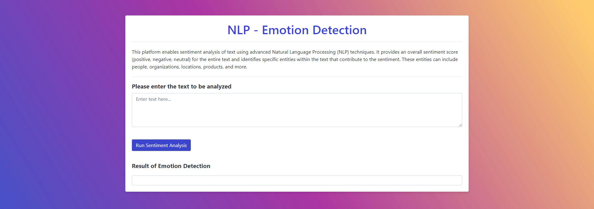

## Emotion Detector

Description: The Emotion Detector Web App is a user-friendly web application designed to analyze the emotions expressed in a given text. Whether it's a piece of writing, a comment, or any textual input, this app provides valuable insights into the underlying emotions.

Azure Deployment: [Emotion Detector](https://app-emotiondetector-web-southbr-dev-002.azurewebsites.net/) (It may take a couple of seconds to load)

Source Code: [Emotion Detector GitHub](https://github.com/MarianoGuastella/Emotion-detector)
