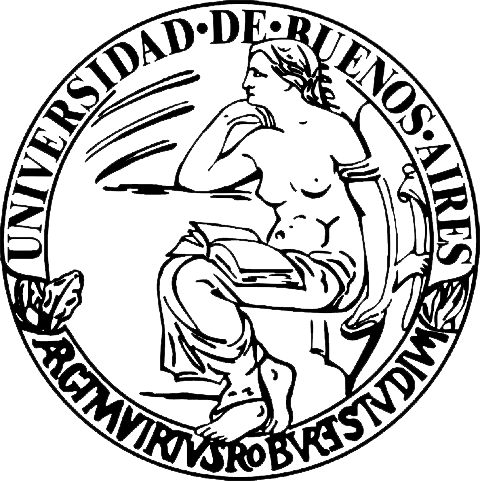
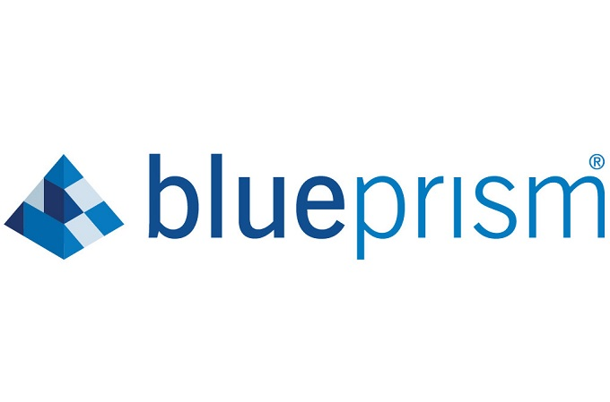

# My Portfolio

## 1. University

Description: This section showcases various projects and assignments I've worked on during my university studies.

Link: [University](University)

## 2. RPA Blue Prism

Description: Explore my work and projects related to Robotic Process Automation (RPA) using Blue Prism.

Link: [RPA_Blue_Prism](RPA_Blue_Prism)

## 3.  Javascript Certification (FCC)

Description: This repository contains my solutions and projects related to the FreeCodeCamp (FCC) Javascript Certification.

Link: [Javascript_Certification_FCC](Javascript_Certification_FCC)

## About Me

I'm a Full Stack developer and currently a fourth-year student in the Computer Science program at the Faculty of Exact and Natural Sciences at the University of Buenos Aires, Argentina.

I'm eager to learn about new technologies and gain hands-on experience in the industry while completing my studies. I have a keen interest in both computer science and the intersection of technology with economics and marketing.

## Contact

Email: marianoguastella@gmail.com

LinkedIn: https://www.linkedin.com/in/mariano-guastella/
